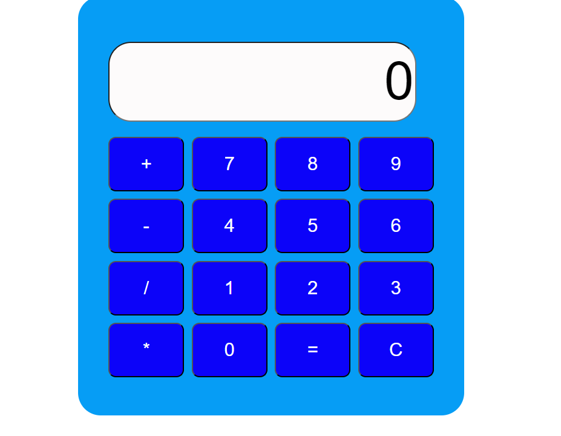

# Calculator Project

This is a simple calculator web application that allows users to perform basic arithmetic calculations.

## Features

- Addition, subtraction, multiplication, and division operations.
- Clear button to reset the input.
- Responsive design for various screen sizes.
- User-friendly interface.

## Demo

You can see a live demo of the calculator 

## Technologies Used

- HTML
- CSS
- JavaScript

## How to Use

1. Clone the repository:

   ```bash
   git clone https://github.com/GeorginaMampuru
   ```
